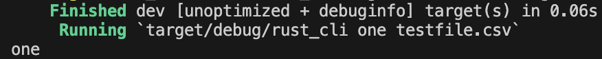

# Week 8: Rust Command Line Tool

## Prep Work
* Confirm rust is installed
* Open to directory of interest and run `Cargo new {yourprojname}`
* change your directory to the new rust project

## Goal of Command Line Tool
* I chose for my command line tool to act similar to a "Find" function
* Entering a word into the command line followed by a path to the file results in a print out of every line that includes the given word.

## Example Use
* To run the command line tool, run the following `cargo run -- {word} {path to file}`
* For example, if I wanted to find the lines that contain the word "contains" in the main.rs program, I would run:
   * `cargo run -- contains src/main.rs`
  

## Unit Testing
* To run tests in rust, add ![test] in front of the function that tests the code.
* Running cargo test runs the tests and provides feedback
* I wrote 3 tests that confirms the functions are working and that there are correct error handling when a file does not exist.

## Example Testing

## With Data File
* The command line has functionality to review CSV files to find lines with the word of interest.

 

